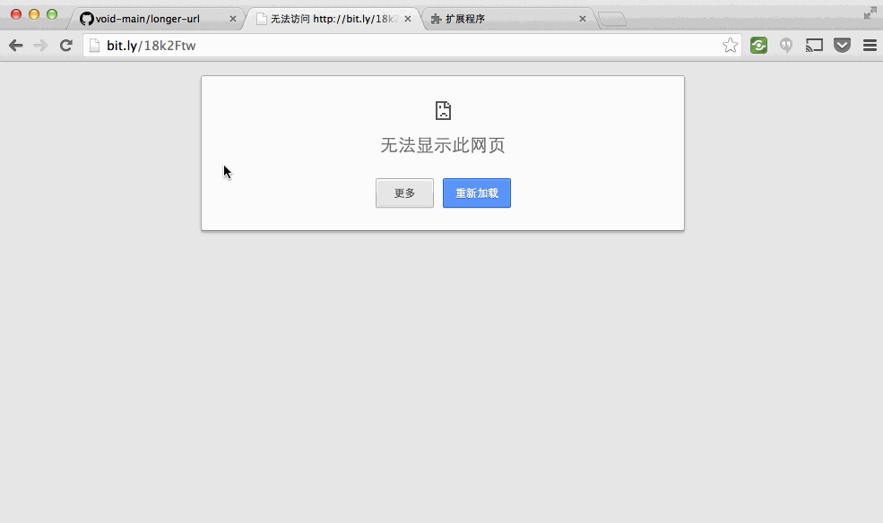

#longer-url
让短网址服务（部分）在墙内可用！

## 短网址并不总是那么方便
上网的时候总是能遇到各种短网址服务，但是国外的很多服务都被墙了。然而被墙的只是短网址服务，短网址对应的真正的url也许在墙内可用，所以我们需要一个工具帮我们跨过短网址的限制。

longer-url就是干这个的！通过在墙外的服务（heroku）帮我们将短url转换回原本的状态，然后再通过浏览器插件的方式无缝跳转到实际的url。

## Demo

上面的例子中，我利用bit.ly服务为[百度首页](http://www.baidu.com)生成了一个[短网址](http://bit.ly/18k2Ftw)，直接访问这个网址的时候，chrome提示无法打开网页，这很正常。如果开启了`longer-url`，再次访问，`longer-url`会自动无缝恢复原始的网址，因为百度没有被墙，所以我们就能看到最终的结果了！
